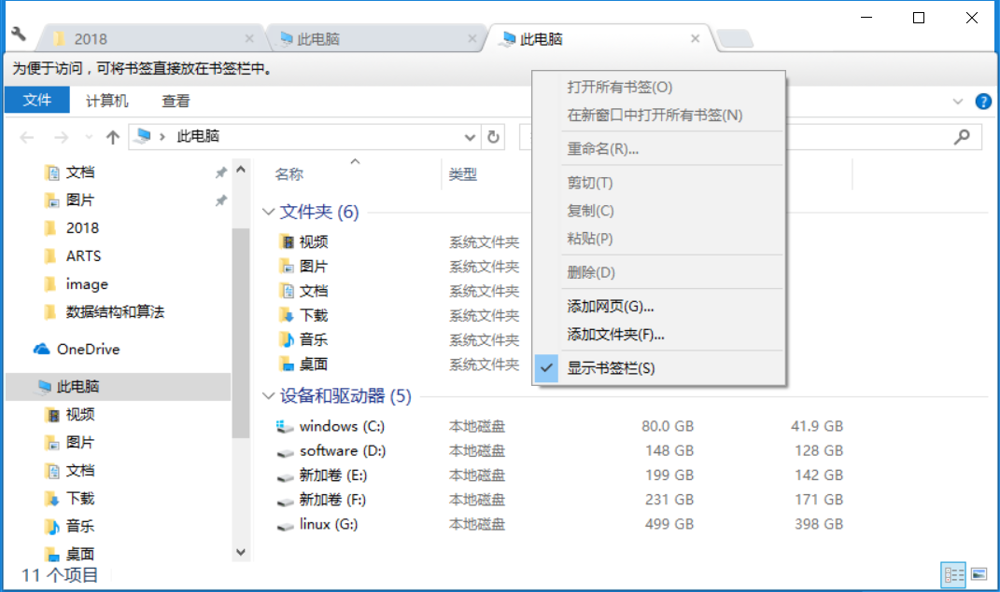

## Algoritm
**从排序数组中删除重复项**

给定一个排序数组，你需要在**原地**删除重复出现的元素，使得每个元素只出现一次，返回移除后数组的新长度。

不要使用额外的数组空间，你必须在**原地修改输入数组**并在使用 O(1) 额外空间的条件下完成。

> 示例 1:
>
> 给定数组 nums = [1,1,2], 函数应该返回新的长度 2, 并且原数组 nums 的前两个元素被修改为 1, 2。 
>
> 你不需要考虑数组中超出新长度后面的元素。

思路：
逐个扫描，当出现未记录的元素，索引值+1，并使该数组下标为该索引值的元素值变更为当前元素.

就是将出现过的元素从数组开头开始保存。
```java
class Solution {
    public int removeDuplicates(int[] nums) {
        if(nums == null) return 0;
        int i, j;
        for(i = 0, j = 0; j < nums.length; j++){
            if(nums[i] != nums[j]){
                nums[++i] = nums[j];
            }
        } 
        return i+1;
    }
}
```

1. 注意考虑特殊情况，比如 nums==null 。
2. 用 length 不用 size() 。length 是数组的基本属性 ， size() 是集合的方法用于获取集合有多少个元素。

## Review

[The Problem You Solve Is More Important Than The Code You Write](https://levelup.gitconnected.com/the-problem-you-solve-is-more-important-than-the-code-you-write-d0e5493132c6)

- Not every code is worth writing 	

  结合实际需求写代码

  例子1：

  蓝牙开门的设备。产品设计为，当使用者靠近房子并按下设备上可视页面的按钮门就开了。

  如果目的是为了蓝牙开门，可视页面就完全没必要。但是用户并不会喜欢任何时候靠近门一定距离门就自动解锁了。

- Not every bug is worth fixing      

  根据影响使用范围和严重程度判断bug优先级

- Not every command is worth scripting 

  There’s a difference between encapsulation（封装） of complex logic and abstraction of useful knowledge. 

- Not every feature is worth coding 

  Your purpose and the purpose of the code you write is to generate value and make the existing world a better place, not to satisfy your egocentric view of what the world should be. 

## Technique

/etc/sysconfig/network-scripts/ifcfg-ethx （注：echx是指设备名，例如eth0等）。 
```
    DEVICE=eth0  #网卡设备名称   
    ONBOOT=yes  #启动时是否激活 yes | no  
    BOOTPROTO=static  #协议类型 dhcp bootp none  
    IPADDR=192.168.1.90  #网络IP地址  
    NETMASK=255.255.255.0  #网络子网地址  
    GATEWAY=192.168.1.1  #网关地址  
    BROADCAST=192.168.1.255  #广播地址  
    HWADDR=00:0C:29:FE:1A:09  #网卡MAC地址  
    TYPE=Ethernet  #网卡类型为以太网
```
**vmware中nat配置注意事项**
1. "编辑"-"虚拟网络编辑器"中NAT设置中有网关IP对应ifcfg-ethxxx 中的GATEWAY
2. IPADDR设置的IP要在DHCP中起始结束IP之间
3. BOOTPROTO设为static 静态IP
4. DNS 114.114.114.114是国内的，8.8.8.8 是谷歌的
验证linux上ping下网关地址，再ping下国内网站。

## Share
**rpm安装和tar.gz包安装**
rpm安装软件是挺方便，但感觉有点虚，比如jdk安装到/usr/bin下也不用配环境变量。但是不知道为什么jps用不了（是我操作的问题吗）。
还是比较喜欢用tar.gz安装，自己建文件夹给权限踏实点。

推荐**Clover**软件，用windows系统经常多开资源管理器，这个软件就很方便。
**Clover**的功能就是给资源管理器加上 Chrome 一样的标签页。                     
**Clover** 只有这么一个功能，但是做的惟妙惟肖。**Clover** 把 Chrome 标签页有的样式、功能、右键菜单、快捷键全部移植，Chrome 控瞬间上手。


